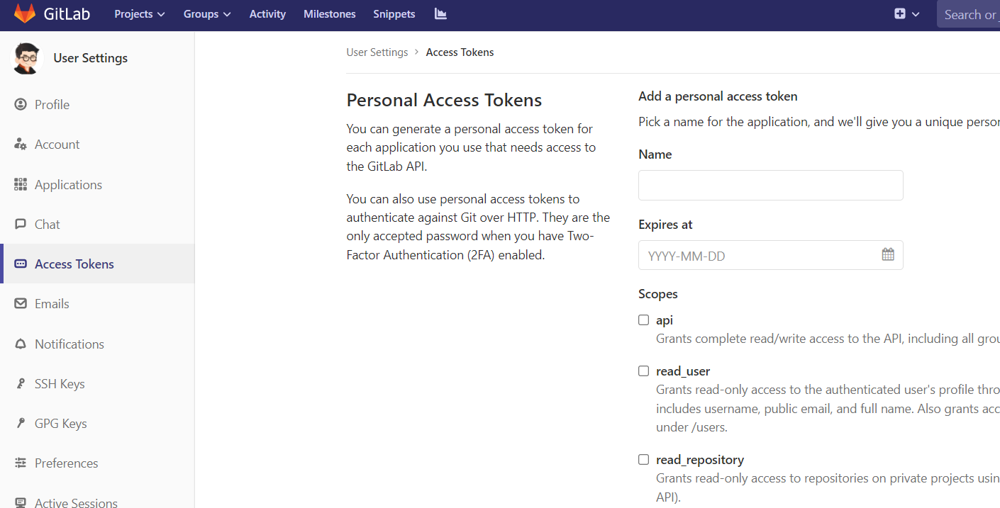
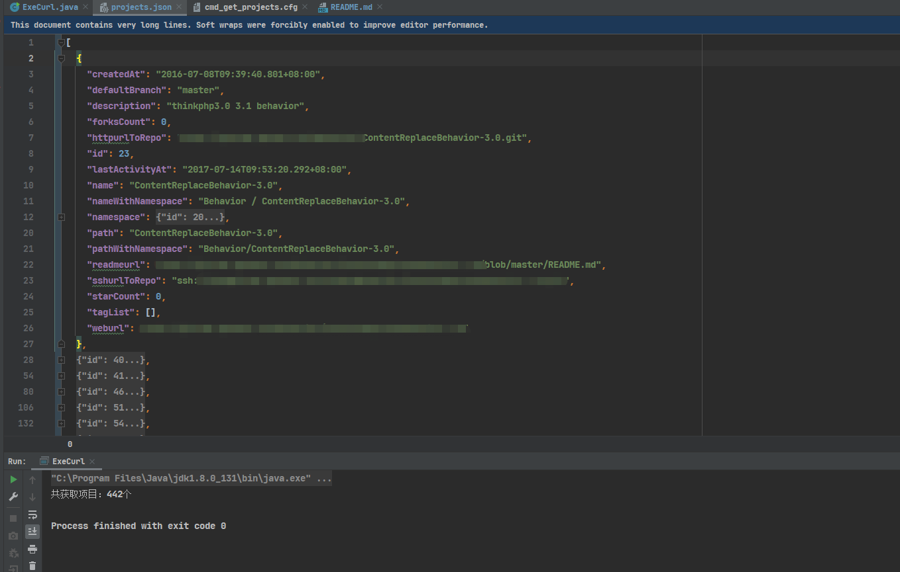

## 遍历gitlab仓库获取项目信息并保存
* 目的：想统计自己在公司的gitlab仓库中可以访问哪些项目，通过gitlab的api接口自动获取
* 参考gitlab [api文档](https://docs.gitlab.com/ee/api/index.html#pagination)
* 在gitlab中申请accessToken
  
* 修改ExeCurl类中GITLAB_ACCESS_TOKEN和GITLAB_URL替换成，刚申请的accessToken和要遍历的仓库地址
* 执行ExeCurl中main()函数，自动拉取项目，并保存到项目的result/header_info.json文件中
* 运行结果获取结果保存到json文件中，挨个查看gitlab项目
